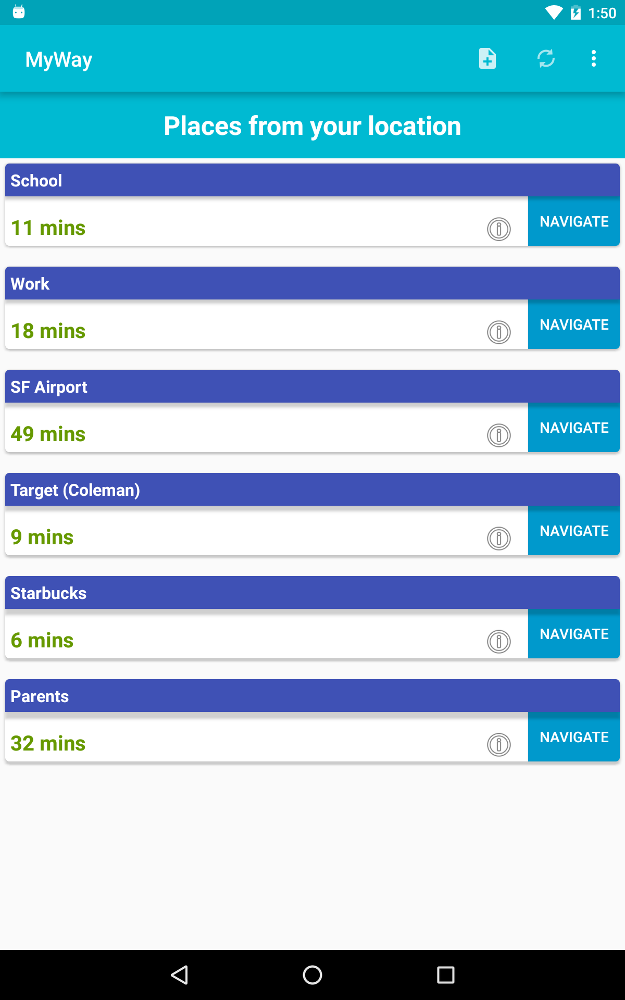
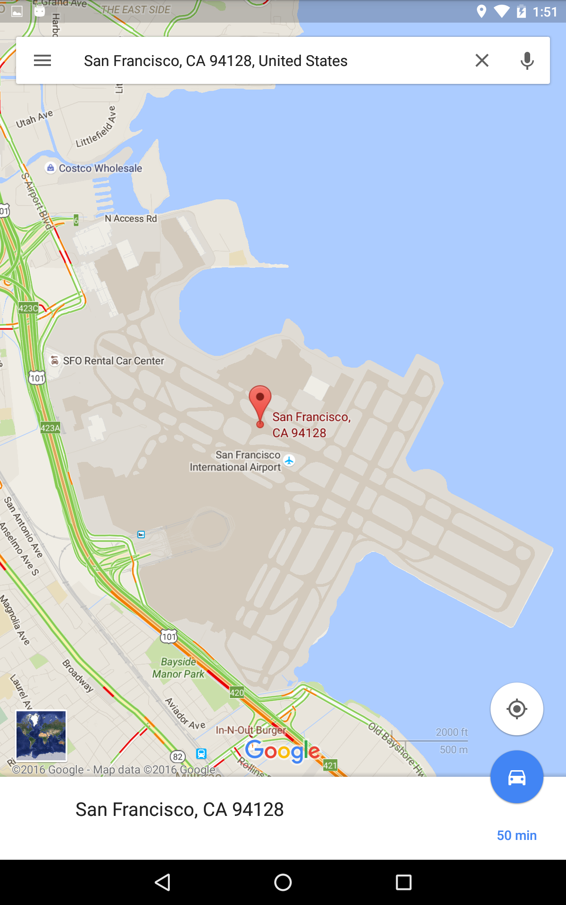
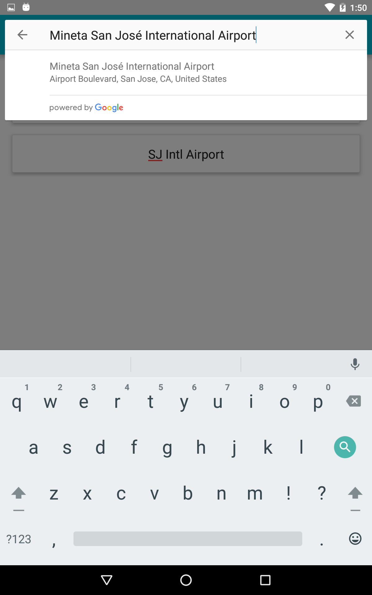

# MyWay

Productive application for commuters who prioritize their time.
Avoid unexpected traffic with quick access to travel times for any place.
Multiple travel times can be obtained at once from any location.

 

Here is the heart of the application. You can see the traffic times for all of the places from your location in real time.

Of course, this app works in conjunction with google maps for easy navigation.

Johnny Nguyen
